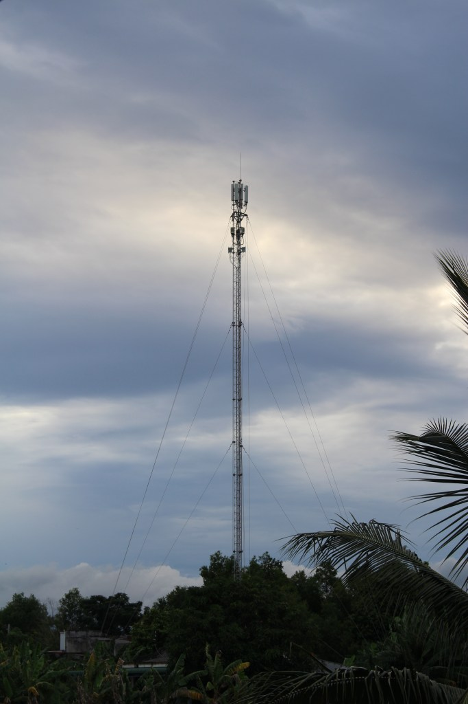

<!-- Imported from WordPress: https://thanhtung0209.home.blog/2023/09/03/balance/ -->

Đợt nghỉ lễ này. Như mọi năm, mình lại về thăm nhà.
Bức ảnh được mình chụp vào chiều ngày 02/09, với trọng tâm là trạm thu phát sóng nằm ngay chính giữa khung hình, những sợi dây cáp nằm đối xứng 2 bên tạo ra cảm giác cân đối cho bức ảnh. Bên dưới là những cây keo, dừa, chuối...
Nhưng có một thứ khiến mình quyết định chụp bức ảnh này, một cảm nghĩ, một ý tưởng hiện lên trước khi bấm nút chụp. Đó là sự cân bằng.
Mỗi lần về thăm nhà, mình được thấy những đổi khác của nơi đây. Nhiều năm trước, khi trạm thu phát sóng kia được dựng lên, mình đã nghĩ rồi vùng quê yên bình này rồi sẽ thay đổi rất nhiều đến mức mình không nhận ra nữa.
Nhiều năm đã trôi qua, cho đến thời điểm hiện tại, suy nghĩ đó của mình dường như chưa đúng. Những cây dừa, cây chuối, xen lẫn là tiếng ếch, nhái kêu giữa đồng ruộng ngập nước, tiếng chim chiều bay về tổ sau ngày dài kiếm ăn, đâu đó thoang thoảng mùi cơm khói từ một nơi nào đó theo làn gió se lạnh bay đến... Trạm thu phí đứng đó, nhưng những thứ trước giờ gắn liền làng quê, gắn liền tuổi thơ của mình vẫn còn hiện hữu... Mới hình thành, cũ vẫn còn đó, đây dường như là sự cân bằng mà bản thân mình thật sự muốn...
Những con đường đã được bê tông hóa, những khu đất treo tấm bảng "Khu Công nghiệp...", những cửa tiệm dịch vụ mới được mở,... đang làm thay đổi nơi đây dần dần. Mình không chắc tương lai sẽ như thế nào. Nhưng mình hy vọng khi những giá trị mới dần chiếm chỗ thì những giá trị cũ sẽ vẫn còn chỗ đứng của mình, mình mong giá trị mới và cũ sẽ luôn đồng hành cùng nhau, tạo nên sự cân bằng và ổn định cho vùng quê này...
