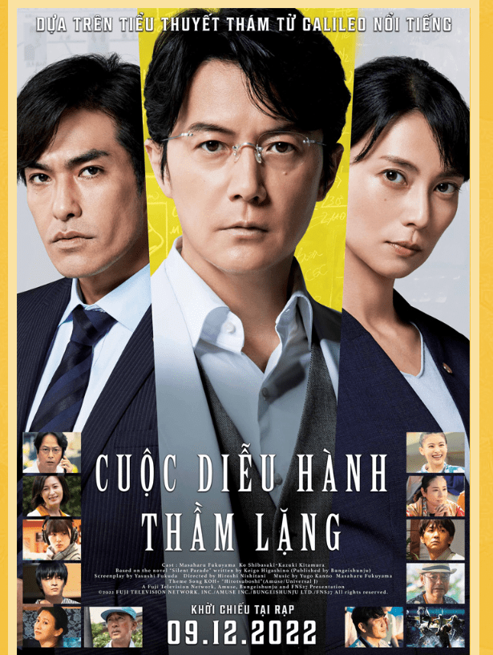

<!-- Imported from WordPress: https://thanhtung0209.home.blog/2022/12/04/blog-chu-nhat-hehe/ -->

Vẫn đang rất enjoy cái đồ án chuyên ngành nha🙂 (nhìn cách hình ở đầu là biết). Giờ là 12h kém, sắp hết ngày rồi nên tranh thủ viết blog hehe (như chạy KPI vậy🙂.)

Hôm qua lướt được thông tin có phim trinh thám được chuyển thể từ truyện sắp ra rạp. Mà lại là của tác giả mình thích. **Higashino Keigo**, tác giả truyện trinh thám Nhật Bản. Mình đã đọc qua truyện lẫn xem phim chuyển thể của ổng, _**Phía sau nghi can X**_, **_Điều kỳ diệu của tiệm tạp hóa Namiya, Hoa mộng ảo, Bí mật của Naoko, Sự cứu rỗi của thánh nữ, Bạch dạ hành_.** Còn ít so với các tác phẩm của ông, hứa khi nào có thời gian sẽ qua nhà chị mình mượn đọc tiếp há há😂. Phong cách viết truyện của tác giả có đào sâu vào tâm lý nhân vật trong truyện, đó là điểm mình rất thích. Và không có quá nhiều sự máu me, kinh khủng, ám ảnh trong cách thức gây án nhưng luôn để lại ấn tượng khó quên bởi những bí mật và thông điệp đằng sau những vụ án. Sở thích của mình cũng là thích xem truyện, phim trinh thám nữa đó.

Nếu tuần sau không kẹt deadline gì thì ngày 9 hoặc 10 mình sẽ đi xem hehe. Cũng gắng sắp xếp để tới đó rảnh.

Cảm ơn bạn đã đọc hehe!!!
