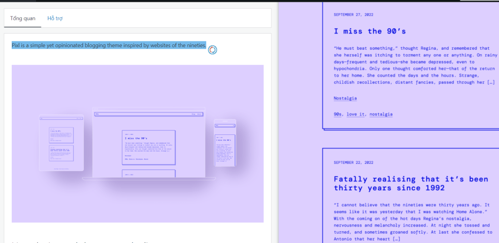

<!-- Imported from WordPress: https://thanhtung0209.home.blog/2022/11/30/blog-dau-tien/ -->

Chào bạn, bây giờ là 10h26p tối ngày 30/11. Đây là blog đầu tiên của mình, mới tập tành thôi nên chưa quen lắm🙂. Mình rất dở môn Ngữ văn nên trong lúc đọc nếu bạn thấy chán thì thông cảm nhé🙂. Nếu bạn được blog này đầu tiên, thì là do mình đã ghim bài này lên đầu tường, nếu bạn muốn đọc tiếp theo trình từ blog số 2, 3, 4... thì hãy kéo xuống dưới cùng, bạn sẽ thấy các mục được đánh số, nếu bạn tìm về cuối thì sẽ thấy những blog cũ hơn. Và ngược lại, những blog mới hơn sẽ nằm về phía đầu dãy.

Đây là blog đầu tiên và khi nào làm được kha khá blog thì mình sẽ đăng link trang này lên FB, mình cũng không ghim blog này lên đầu tiên. Nên là nếu bạn kéo tới đây và đọc thì mình sẽ rất cảm kích luôn đó, biết ơn bạn rất nhiều❤️.

Đáng ra blog đầu tiên này mình nên mở đầu giới thiệu về bản thân mới đúng nhưng mình muốn bạn hiểu về mình theo cách của bạn thông qua những blog mình viết sau này hơn (Mong là sẽ còn duy trì viết dài dài, haha).

Nhìn theme của blog này có vẻ phèn và xưa xưa đúng không. Thật ra lúc mới tạo tài khoản WordPress đề xuất theme cho blog đầu tiên và cái này nó đập ngay vào mắt mình khi đó. Kiểu văn bản này nó lấy cảm hứng từ những năm 90 (bạn có thể xem thêm ở phần hình ảnh mình gửi lên), cũng khá phù hợp với kiểu người thích đơn giản và những thứ xưa xưa cũ như mình🙂. Và cũng thêm một điều nữa, blog nó là từ gọi tắt của weblog và là một dạng nhật ký trực tuyến, bùng nổ từ cuối thập niên 1990. Có sự liên quan gì đó với còn số 90 đúng không, nghe lỗi thời quá đó :)))

Cảm hứng để tạo cái blog này của mình chắc có thể tự nhiều lý do lắm, mà chủ yếu là do một mình...

Nói sao nhỉ, nay đuối quá đuối. Hôm nay dậy từ 5h30 để chạy từ Dĩ An vào q.10 học, không kịp ăn sáng nữa🙂. Môn thí nghiệm in 3D ấy mà, vào lab chạy máy rồi ngồi đợi mấy tiếng máy in thôi, nhờ vậy mà mình cũng chợp mắt được xíu. Tới trưa thì mình phát hiện mẫu in của mình bị lỗi nên sau đó phải chuẩn bị mẫu khác và in lại, thế là không ăn trưa nốt🙂. Chiều mình tiếp tục học thí nghiệm tới khoảng 4h30. Tối giờ làm đồ án nữa đó, chuyện đồ án mình sẽ kể sau, cũng stress lắm🙂.

Blog đầu tới đây thôi, blog đầu tiên mới vào đã than thở rồi đúng không🤣. Cũng vừa qua 23h, skincare rồi đi ngủ thôi, mai mình còn đi làm nữa.

Cảm ơn bạn lần nữa đã kiên nhẫn đọc blog đầu tiên nhạt nhẽo và xàm xí của mình❤️.
