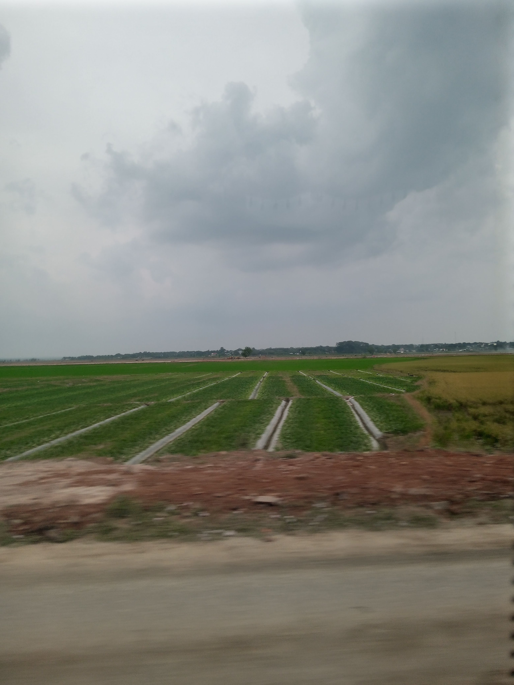

<!-- Imported from WordPress: https://thanhtung0209.home.blog/2023/01/01/bong-nhien-thay-nho-nha/ -->

Tuần trước ba mẹ có gọi cho mình. Hỏi mình có về nghỉ Tết Tây hay không. Mình trả lời là không vì nghỉ ít ngày và cũng mới về vì bà nội mất cách đây không lâu. Thật ra đó là lý do mình đưa ra để trốn tránh mà thôi. Mình nghe câu hỏi đó của ba mẹ gần đây cũng không phải một lần, chắc ba mẹ cũng mong mình về...

Thế là đợt đi Vũng Tàu vừa rồi, mình lại có cảm giác nhớ nhà thông qua những hình ảnh mình bắt gặp trên đường đi và tại nơi mình ngồi ăn. Trên những đoạn đường đi qua, mình bắt gặp ngôi nhà, cánh đồng, đồi núi phía sau xa... Đọc tới đây chắc bạn sẽ cười vì những hình ảnh đó quá sức bình thường, đi đâu cũng thấy phải không. Nhưng đối với mình, nó lại tạo cho mình cảm giác rất quen thuộc như những gì mình thấy hằng ngày trên đường đi học suốt những năm cấp 2 và 3. Tới đây thì cảm xúc bắt đầu dây chuyền từ chỗ nhớ lúc hay chạy trên đường đi học tới nhớ nhà😆. Tiếp theo là khi ngồi ăn sáng tại resort, mình bắt gặp cái dĩa trong ảnh trên, kiểu dĩa như thế, đã rất lâu rồi mình không thấy lại. Đó là kiểu dĩa mà nhà ngoại mình lúc trước hay dùng, mỗi lần nhà ngoại có cúng là sẽ bắt gặp. Mỗi lần gặp ngoại là bà hay nói "Mi sắp cưới vợ chưa" hay "Thằng ni cưới vợ đi cho rồi"🤣. Nhìn xong nhớ ngoại rồi tới nhớ nhà luôn🙂.

Ảnh này chụp đoạn đường khác đoạn mình đang đề cập🤣.

Khoảng 14-15 mình mới được về, đợi hết hợp đồng 4 tháng thực tập đã. Năm nay Tết Dương lịch và Tết Nguyên đán gần nhau nên cảm giác nhớ nhà nó cũng được kéo dài hơn á chớ.

Hôm nay có nhiêu đây thôi. Cảm ơn bạn đã đọc nha❤.
