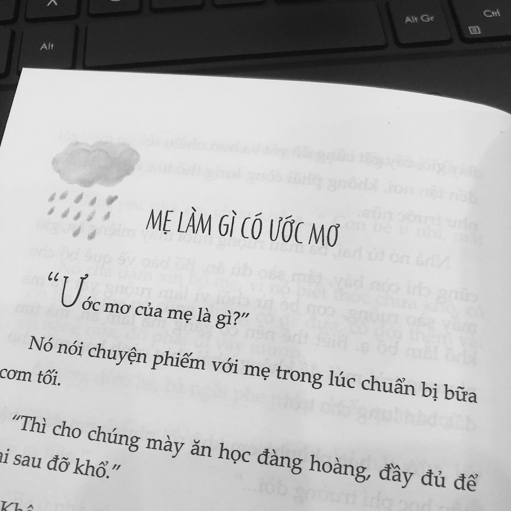

<!-- Imported from WordPress: https://thanhtung0209.home.blog/2023/03/15/dau-phu-uoc-mo-ba-va-me/ -->

Ước mơ, là những mục tiêu, hoài bão, mong muốn và khát khao về một thứ gì đó mà con người ta luôn muốn đạt được tùy thuộc vào mỗi giai đoạn khác nhau của cuộc sống. Nó như là kim chỉ nam, giúp chúng ta có thêm động lực để không ngừng cố gắng. Cũng như mình, các bạn chắc ai cũng có một ước mơ xinh đẹp cho riêng bản thân nhỉ? Và bỗng một ngày mình cũng biết được ước mơ của ba mẹ là gì...

Trong một bữa ăn tối bình thường của gia đình, có món đậu phụ chiên, cái tên món nó giản dị là vậy nhưng để có thể thực sự ngon thì không dễ chút nào. Đầu tiên đậu phụ phải ngon, ngon theo mẹ mình nói là đậu phụ không trộn thêm gì hết (cắn miếng nào cũng mềm tan trong miệng), thời buổi này ngoài chợ toàn bán đậu phụ trộn phụ gia vào (mẹ mình nói là bột thạch cao🙂) nên khi ăn sẽ có cảm giác sượng cứng không mềm và đậu phụ ngon còn phải thơm, không bị chua... Trở lại chủ đề (hơi lạc đề xíu🤣), hôm đó mẹ mình mua thử đậu phụ ở chỗ mới về ăn thử, sau đó thì cả nhà khen ngon😋 và mẹ mình có nói ra một câu: "Hồi xưa ba mi ước mơ ăn được một miếng đậu phụ đọ". Vậy là ba mình từng có một ước mơ, một thứ là điều bình thường ở thời buổi hiện nay nhưng ở khoảng thời gian khó khăn gọi là bao cấp đó, ăn không đủ no mặc không đủ ấm đó, nó như là một điều xa xỉ với ba mình vậy... Sau khi mẹ nói xong, mình thấy mắt ba rưng rưng, ba kể hồi trước đói lắm, khổ lắm, không có gạo ăn mà phải ăn hạt bo bo (có tên gọi khác là ý dĩ hoặc cườm thảo, thời nay người ta trồng lấy hạt cho gà ăn🙂), với ba lúc đó được ăn một miếng đậu phụ ngon là đã mãn nguyện rồi... Đó không phải là lần đầu tiên ba mẹ kể về những khó khăn, cực khổ thời bao cấp nhưng là lần đầu tiên mình nghe về ước mơ của ba. Sau khi mẹ sinh mình ra, ba mình đã quyết tâm bỏ thuốc lá và sau này là hạn chế nhậu nhẹt tiệc tùng để làm gương cho mình❤.

Còn về mẹ, mình chưa bao giờ hỏi về ước mơ của mẹ nhưng mình vẫn hay nghe mẹ nói rằng: "chừ mong tụi bây đứa mô đứa nấy có việc làm sống ổn định hết là khỏe, tau với ba mi ở nhà ăn mì tôm qua ngày là được rồi". Mình không biết nó có phải ước mơ của mẹ hay không nhưng mình vẫn luôn cố gắng để điều đó trở thành hiện thực. Mẹ là người luôn lo lắng từng chút một cho mọi người trong nhà và mình cũng học từ mẹ nhiều tính cách tốt đẹp, thứ chiếm phần lớn định hình nên con người mình hiện tại❤.

Cuộc sống gia đình mình giờ cũng khá hơn rất nhiều rồi (nên không có chuyện ba mẹ mình ăn mì tôm qua ngày đâu nha🤣) và mình cũng sắp ra trường nên chắc trong lòng ba mẹ cũng thoải mái và hạnh phúc hơn hồi trước rất nhiều. Nhà mình cũng đang xây lại nè, mình sắp có phòng riêng được lắp máy lạnh nha (nào xong hứa sẽ làm blog review🤣).

Cảm ơn bạn đã đọc! Nếu chưa có ước mơ gì thì chúc bạn sớm tìm được ước mơ cho riêng mình nhá. Và luôn tiện thì... ước mơ của ba, mẹ bạn là gì...
