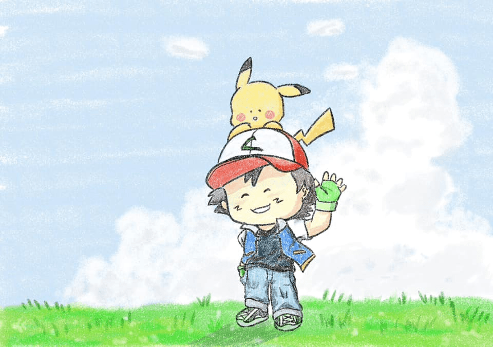

<!-- Imported from WordPress: https://thanhtung0209.home.blog/2023/04/09/%e3%81%84%e3%81%8f%e3%82%88-di-thoi-nao/ -->

"いくよ" - "đi thôi nào", từ mà Satoshi hay nói với những người bạn đồng hành của mình khi bắt đầu chuyến đi mới cùng với những thử thách, điều thú vị mới đang đợi cậu phía trước.

Tập cuối của "The Distant Blue Sky" đã được công chiếu rồi, nó như là lời tạm biệt của Satoshi và Pikachu gửi đến mình vậy. Trước đây mình đã viết một blog nói lên cảm nghĩ của bản thân về tập phim đặc biệt này (Link blog mình sẽ để bên dưới nha😉). Mặc dù anime vẫn còn tiếp tục với những nhân vật mới cùng những chuyến phiêu lưu mới, nhưng Pokemon trong mình vẫn luôn là Satoshi và Pikachu. Satoshi à, thế là đến lúc chúng ta nói lời tạm biệt rồi nhỉ... Một lần nữa cảm ơn cậu và Pikachu vì đã trở thành một phần tuổi thơ tuyệt vời của mình nha!

Nếu bạn đang đoc blog này, mình mong bạn nên đọc thêm blog "The Distant Blue Sky" của mình nữa, sẽ giúp bạn hiểu thêm một chút về mình cũng như anime Pokemon🤣, link blog: [https://wordpress.com/post/thanhtung0209.home.blog/316](https://wordpress.com/post/thanhtung0209.home.blog/316)

"THE FIRST TAKE" là một kênh YouTube của Nhật Bản mời các ca sĩ biểu diễn một bài hát được thu âm trong một lần. Các video trong The First Take được quay trong studio, xen kẽ các cảnh quay và cận cảnh ca sĩ biểu diễn, với nền thường có màu trắng. Đoạn phim được ghi ở độ phân giải 4K với âm thanh chất lượng cao😗. Và nhân dịp kết thúc cuộc hành trình của Satoshi và bạn đồng hành của cậu - Pikachu, kênh đã mời một nhân vật đặc biệt để trình diễn một ca khúc cũng rất đặc biệt dành tặng người xem...

https://www.youtube.com/watch?v=hMKf5mE3sdo&ab\_channel=THEFIRSTTAKE

Đó là Rika Matsumoto, diễn viên lồng tiếng cho Satoshi, nhân vật chính trong loạt phim 'Pokémon' được phát sóng từ năm 1997 và được yêu thích không chỉ ở Nhật Bản mà trên toàn thế giới. Cô cũng chính là người đã thể hiện bài hát mở đầu đầu tiên của bộ anime, tên bài là Mezase Pokemon Master. Mở đầu bài hát "いくよ" - "đi thôi nào" đã làm mình rất xúc động và nổi da gà. Hồi đó mình nghe xong bài này tên tivi rồi nghiện luôn, khi nào mở xem cũng hát theo🤣.

Bây giờ còn mong cái kết của Thám tử lừng danh Conan và One Piece nữa thôi nhỉ...
