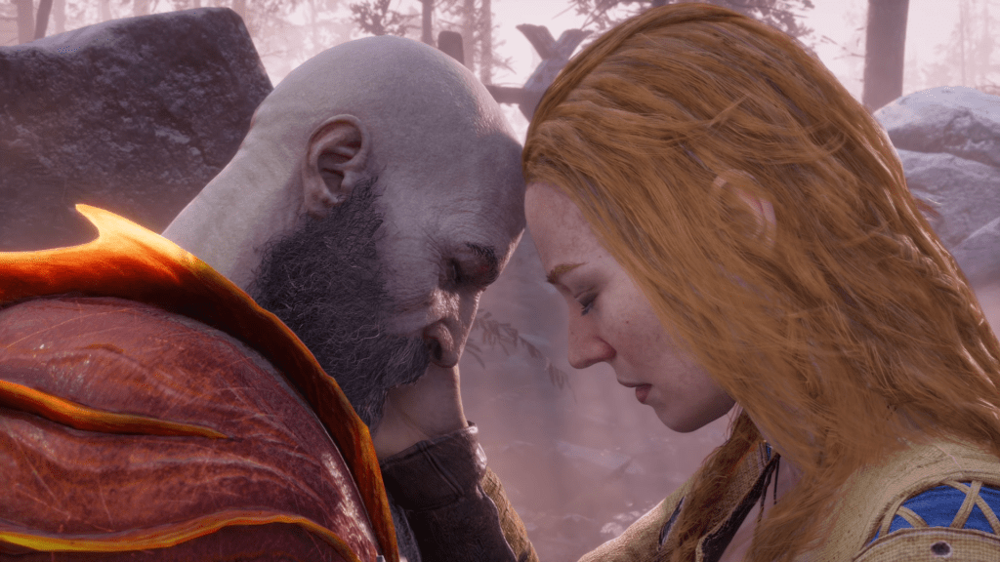

<!-- Imported from WordPress: https://thanhtung0209.home.blog/2022/12/06/game-va-thong-diep-ve-tinh-yeu/ -->

_Mình đã rất xúc động khi xem tới đoạn trong ảnh..._

**God of War Ragnarok**, tựa game mới ra hồi tháng 9 năm nay. Đây là phần thứ 9 trong cả series theo trình tự thời gian và là phần tiếp theo của **God of War** năm 2018. Nhân vật chính trong suốt cả series là **Kratos**. Nội dung khá dài nên nếu mọi người muốn tìm hiểu về cốt truyện thì mình sẽ để link ở cuối blog nha.

Theo tiêu đề thì nội dung sẽ nói về câu chuyên giữa **Kratos** và người vợ thứ hai tên là **Faye** (tên thật là **Laufey**). Lưu lạc đến Bắc Âu, Kratos đã gặp **Faye**. Một người phụ nữ và một người đàn ông đã mệt mỏi vì chiến đấu, tìm đến nhau để cùng chữa lành những vết thương về tinh thần. Sự thấu hiểu, đồng cảm với quá khứ, những điều **Kratos** đã trải qua đã giúp **Kratos** như được sống lại lần nữa. Dù biết quá khứ của **Kratos**, cô không chút tránh né, bao dung, luôn muốn **Kratos** phải mở lòng mình ra với mọi người như cách anh mở lòng với cô và nói rằng sẽ bảo vệ anh bằng bất cứ cách nào. Cô ấy ở bên anh ấy và yêu anh ấy cũng như **Atreus** (đứa con trai của 2 người) cho đến cuối đời. **Faye** che giấu sự thật rằng cô ấy là người khổng lồ của Jotunheim là do cô ấy đang cố gắng bảo vệ cả cô ấy và con trai mình.

Còn về **Kratos**, anh trước đây phải chịu trách nhiệm về cái chết của người vợ và đứa con đầu tiên của mình, cùng với nhiều bi kịch xảy ra khác, anh dần khép mình và bị ám ảnh về quá khứ. Nhờ **Faye**, anh dần mở lòng ra hơn, thay đổi dần tính cách con người mình.

Biết trước cái chết của mình, **Faye** lên kế hoạch bảo vệ hai cha con khỏi sự truy tìm của các vị thần Bắc Âu. Không chút run sợ, đón nhận nó như định mệnh tất yếu với thái độ bình thản, cái mà cô lo sợ là sự an toàn của hai cha con, đặc biệt là **Atreus**.

Khung cảnh cuối, hai người tâm sự cùng nhau, chạm đầu vào nhau. **Faye** an ủi **Kratos** về cái chết sắp đến với mình, đồng thời căn dặn anh phải tiếp tục sống tiếp, hai người sẽ luôn là một phần của nhau mãi mãi.

Game đã làm rất tốt khi cho người chơi thấy **Faye** thực sự quan trọng như thế nào đối với **Kratos** và anh ấy quan tâm sâu sắc như thế nào. Bất chấp tất cả những cái chết mà anh ấy đã chứng kiến ​​và gây ra, anh ấy vẫn cảm thấy khó chấp nhận rằng một ngày nào đó **Faye** sẽ ra đi. Điều này được thể hiện trong video link 1.

Link phân cảnh giữa 2 người trong game:

https://www.youtube.com/watch?v=DzlJQzS-C2g

Link cốt truyện game (vì game khá nhiều phần nên bạn có thể xem những phần tiếp theo của kênh Phê game nha, kênh có làm đủ hết á).

https://www.youtube.com/watch?v=o3sesEr1VVE
