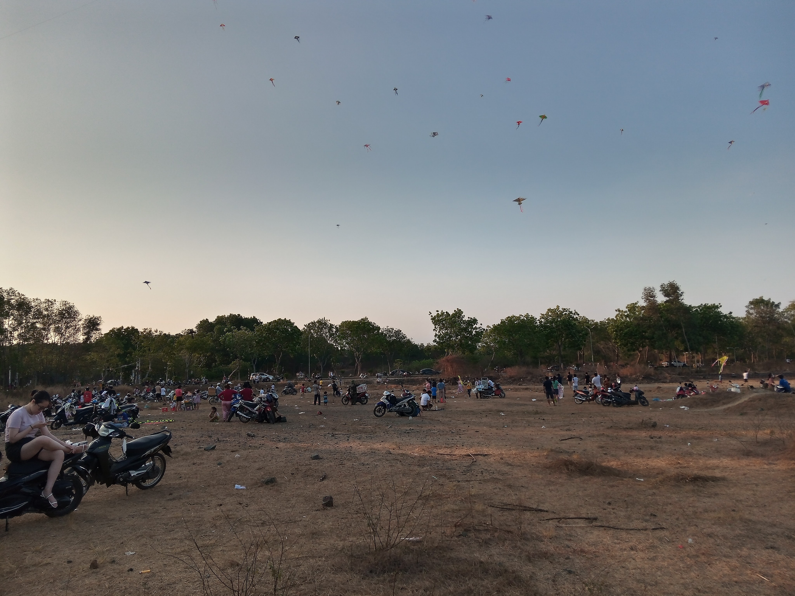
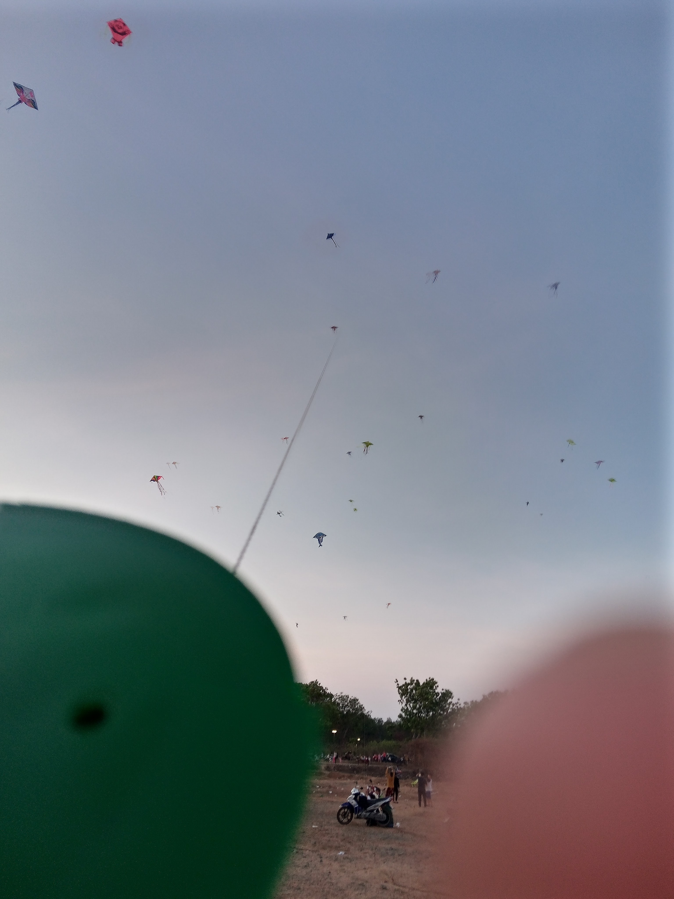

<!-- Imported from WordPress: https://thanhtung0209.home.blog/2023/03/25/gio-noi-dieu-len/ -->

Chiều nay anh chị mình lên làng thả diều, anh rể cũng từng là sinh viên trong làng, hồi đó anh cũng hay ra thả diều nên nay về ôn lại kỷ niệm á mà🤣. Thế là anh chị rủ mình qua thả diều cùng luôn tiện ra lấy lại khăn tắm (hôm bữa qua nhà chị chơi, đem khăn theo lại quên mang về🤣) và có cả cơm chị nấu nữa😋.

Thú thật đây là lần đầu tiên mình thả diều... Hồi nhỏ thấy mấy bạn cùng lứa thả diều ngoài đồng mà mình cũng muốn ra lắm nhưng ba mình lại không cho... Ba mẹ mình không cho mình ra ngoài chơi vì sợ mình tiếp xúc với bạn hư... và cũng là con trai một trong nhà nên chuyện tự kiếm đồ rồi chơi một mình đã trở thành điều bình thường trong suốt quãng thời gian tuổi thơ của mình rồi. Hơi lạc đề rồi, quay trở lại chuyện thả diều, sau 2 lần mà vẫn chưa thả được (theo như lời anh rể nói là do gió yếu🤣) thì cuối cùng mình cũng tự đưa diều lên cao tít trên trời được rồi❤. Cảm giác thật là yomost😆.

Thả tới trời tối thì mình đi tìm đường tới tiệm kia để mua cái kính che mũ bảo hiểm và đến lúc về thì đi nhầm đường🙂. Đường đi tới xưởng bụi lắm, mới được anh chị cho cái mũ 3/4 mà chưa có kính nên luôn tiện đi mua kính che luôn.

À mà lâu rồi mới viết blog 2 ngày liên tiếp á. Chắc là vì điều đặc biệt mà trước giờ mình chưa làm được!

