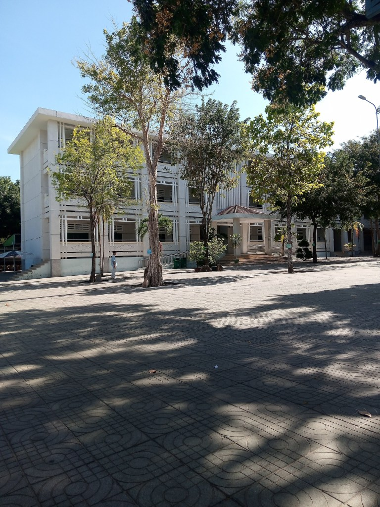
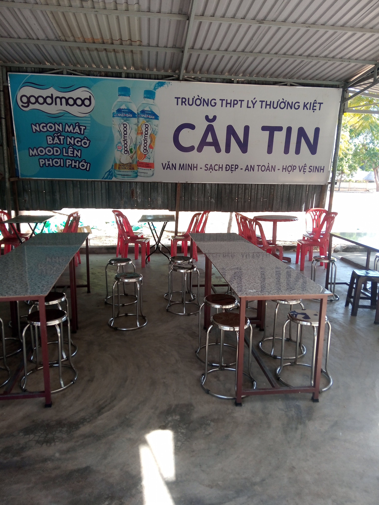

<!-- Imported from WordPress: https://thanhtung0209.home.blog/2023/02/07/hom-qua-minh-ve-tham-truong-cap-3/ -->

Trường nay nhìn đẹp hơn, xanh hơn, dù không nhận ra rõ ràng là trường nay khác trường xưa như thế nào. Nhìn cây Bông gòn, cây Hoa sữa vẫn còn trong sân trường thì nhớ ngay đến thầy Khải. Thử đi một vòng vào căn tin, qua sân thể dục, nhà kho, khu học bơi, dãy phòng học, mỗi lần đi qua là khung cảnh kỷ niệm hiệm lên... Có gặp thầy Tuấn, thầy Thành, qua bao năm vẫn giữ vai trò là giám thị của trường và thầy Tuấn vẫn nhớ ra mình❤.

Đi ra căn tin, nhớ hồi đó lớp 12, chiều học ra là chuẩn bị đi học thêm, mình ra căn tin mua 1 chai Revive và kèm câu "Cô ơi bán cho con bánh chi đó mà ăn no no á cô". Và cứ tuần này qua tuần khác như vậy, cô nhớ luôn mặt mình và cả câu mình hay hỏi🤣. 3 năm trước mình đi về thì cô vẫn nhớ ra mình❤, hôm qua thì cô không có bán nên không gặp được.

Nhìn sân trường một lúc trong lòng bỗng nhiên về nhớ những buổi sáng, trường thường phát bài Phượng Hồng. Câu từ trong của bài hát vang lên trong đầu mình: "Những chiếc giỏ xe chở đầy hoa phượng, em chở mùa hè của tôi đi đâu..."🙂. Không hẳn chỉ khi về trường mới nhớ mà lúc bình thường bỗng nhiên vẫn hay nhớ đến thời điểm đó. Khi còn là học sinh mỗi sáng đi học sớm nhất nhì lớp, giữa không gian yên tĩnh loa trường phát ra những bài nhạc về tuổi học trò, những lời bài hát như dần thấm vào tâm trí lúc nào không hay...

Hẹn dịp khác nhé. Lý Thường Kiệt❤
