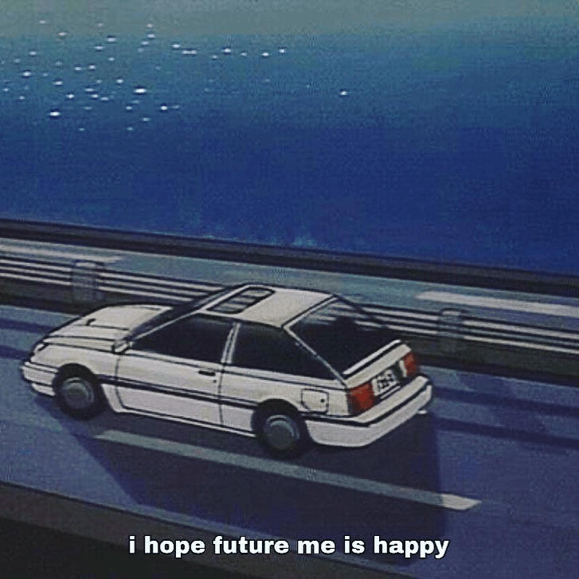

<!-- Imported from WordPress: https://thanhtung0209.home.blog/2022/12/22/khong-tieu-de-1/ -->

Vừa rồi mình phỏng vấn cho vị trí nhân viên chính thức không được tốt lắm. Đợt apply lần này mình muốn tự thử sức bản thân xem có thể đến được đâu nên cũng chuẩn bị sẵn tinh thần cho trường hợp xấu. Nhưng mà sau khi phỏng vấn xong, mình lại trách móc bản thân vì những câu trả lời chưa được tốt đó. "Đáng lẽ nên nói thế này", "Đáng lẽ bình tĩnh hơn, chậm lại một nhịp thì đã trả lời đúng hơn"... Sau đó, mình nghĩ _nếu có lần hai thì mình chắc chắn sẽ nói khác đi và làm tốt hơn._

Đúng vậy, có những chuyện xảy ra khiến tụi mình dễ trách móc, chán ghét, giận dữ bản thân về những chuyện đã xảy ra trong quá khứ. Nhưng thật ra, ở thời điểm đó tụi mình đã làm tốt nhất có thể với những gì mình biết... Và sau những lần ngớ ngẩn như thế đã giúp bản thân nhận ra, rút kinh nghiệm sâu sắc cho những lần tiếp theo. Cũng như khi mình ở đây ngay tại lúc này, nghĩ về những lần từng hâm đơ ngớ ngẩn mà tới giờ mình vẫn không sao hiểu được, mình chấp nhận và thầm biết ơn vì những câu chuyện trong quá khứ dù không hoàn hảo, xinh đẹp, nhưng đã góp phần tạo nên mình của ngày hôm nay. Vậy nên đừng khó khăn với chính mình quá nhé.

Trở lại với mình hiện tại. Trong trường hợp xấu xảy ra thì mình cũng đã có kế hoạch làm gì tiếp theo. Sắp tới sẽ bật mí cho các bạn sau hen😉.
