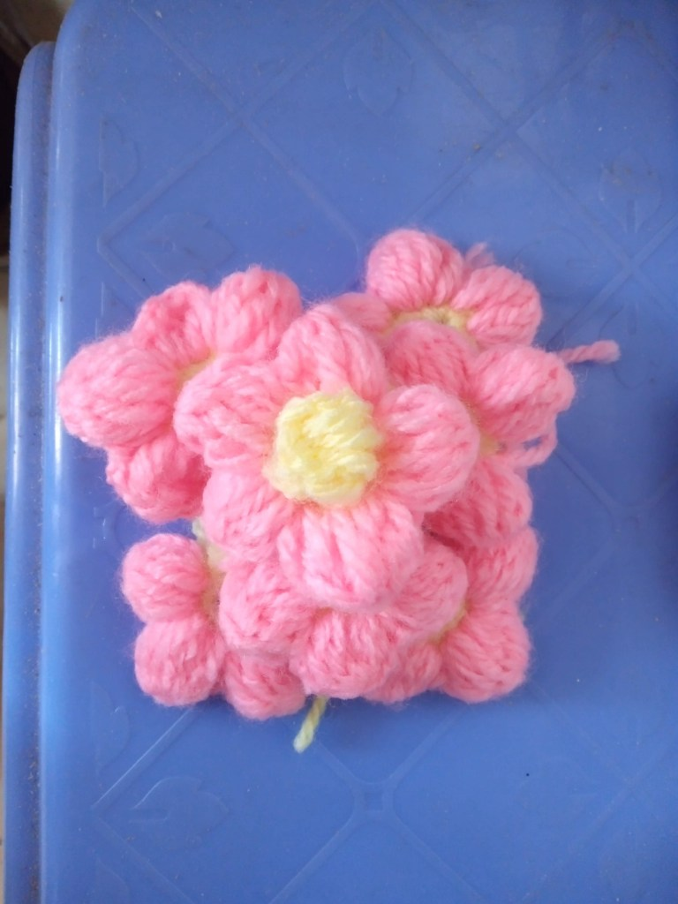

<!-- Imported from WordPress: https://thanhtung0209.home.blog/2023/03/08/lan-dau-tien-tu-tay-lam-san-pham-bang-len/ -->

Hôm nay đã móc xong hoa. Gọi là móc hoa vì dùng móc chứ không phải que đan, lúc tìm hiểu mới biết có 2 cách là đan len và móc len, đan dành cho đồ có kích thước lớn như áo hay mũ, còn nhỏ như bông hoa mình làm đó thì dùng móc.

Hoàn thành sản phẩm đầu tiên kịp deadline 8/3🤣. Tay mình chưa khéo nên hoa chưa được đẹp lắm. 1 tuần để tập móc nhưng thời gian dành cho việc mò nay là khoảng 2 tiếng mỗi ngày, tay khá mỏi và đau ở chỗ giữ len (do mình làm chưa đúng cách, còn giữ chặt sợi len quá nên vậy🙂).

Sáng nay thử móc thêm vài cái xem có đẹp hơn mấy cái đầu mình đan hay không, mà nó vẫn vậy(như này sao dám đem tặng cho người ta🤣). Hẹn hôm nào khác mình sẽ tập móc tiếp cái khác hihi😁.
