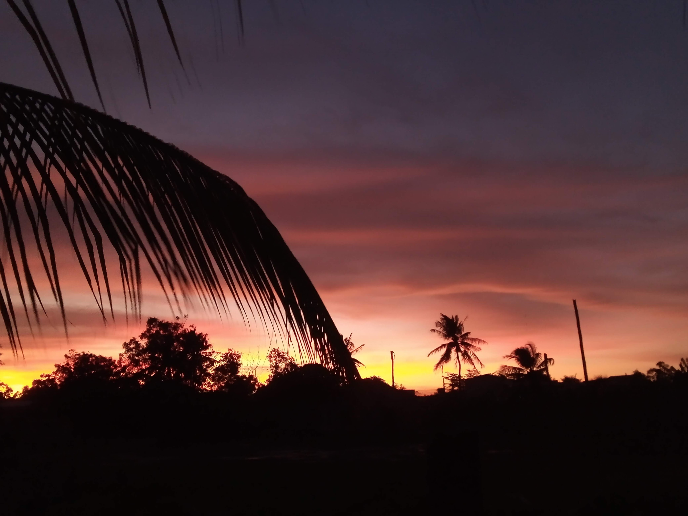

<!-- Imported from WordPress: https://thanhtung0209.home.blog/2023/02/18/lau-chay-ngon/ -->

Ảnh trên chụp lúc mình còn nghỉ tết, cam thường thôi chứ chụp phong cảnh mình không dùng filter gì đâu á. Hoàng hôn đẹp cùng với khung cảnh vùng quê làm mình cũng thấy trong lòng yên bình theo. Nhưng mà ban đêm thì khá là sợ🙂. Không phải sợ ma đâu nha, mà là sợ kẻ xấu. Mình có đọc một chút về tâm lý học tội phạm, trời tối và không gian yên tĩnh như vậy sẽ thúc đẩy những người có ý nghĩ xấu hành động. Mình thì thức khá khuya nên khi tới giờ đánh răng rửa mặt đi ngủ thì không gian xung quanh nó rất yên tĩnh. Vì mình là người ngủ cuối cùng nên ba mẹ luôn dặn phải kiểm tra cửa cẩn thận rồi mới đi ngủ, trong xóm có cũng nhiều trường hợp mất trộm gia súc, tài sản. Mình cũng rất lo khi chị em mình trên thành phố cả rồi, xóm thì nhiều người lưu manh lắm, chỉ có ba mẹ ở nhà với nhau nên cũng lo...

Tuần này phòng mình có đi ăn lẩu chay với nhau, thật ra là có 1 ông không đi và 1 ông thì đi chơi chưa về, còn lại 4 ông trong đó có mình. Đây là lần đầu tiên mình ăn lẩu chay á, trước giờ muốn đi mà chưa rủ được ai🙂, nay ăn rồi thì thấy lẩu chay rất ngon😋.
