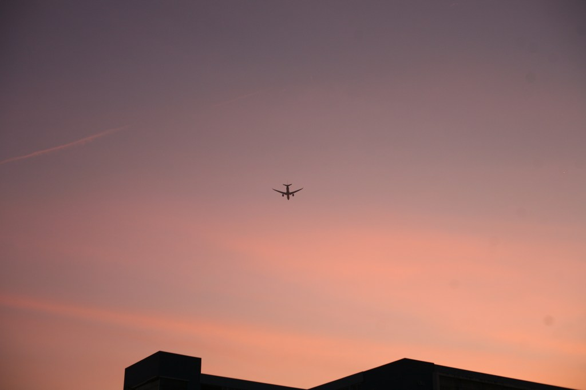

<!-- Imported from WordPress: https://thanhtung0209.home.blog/2023/02/28/ly-tuong-song-cua-ban-la-gi/ -->

Ảnh trên mình chụp vào chủ nhật tuần rồi. Gần đây hoàng hôn đẹp lắm nên hầu như chiều nào mình cũng ra ngắm chứ không chỉ cuối tuần như trước nữa (với lại kỳ này hết đi làm rồi rảnh quá nên vậy á🤣). Mình chụp bằng máy ảnh mượn của thầy á, hỏi mượn để làm luận văn mà toàn đem đi chụp cảnh🙂, với lại giờ chốt đề tài khác rồi nên không cần dùng tới nữa🤣.

Với mình, khi nhìn hình ảnh máy bay, nó luôn gợi nhớ về mục tiêu, lý tưởng sống mà mình luôn dõi theo và mong bản thân sẽ đạt được. Hình ảnh máy bay sải cánh trên bầu trời như mang theo những mục tiêu, hoài bão tiến về phía trước và hành trình nào cũng đều có đích đến như muốn nhắn nhủ rằng mọi lý tưởng đều sẽ thành hiện thực nếu chúng ta đủ kiên trì và cố gắng. Tuy nhiên việc tìm ra cho bản thân một lý tưởng để cố gắng thì lại là một vấn đề không dễ chút nào.

Cũng trùng hợp là gần đây cụm từ lý tưởng sống mình lại nghe tới khá nhiều. Như trong phim Alice in borderland, trong video phỏng vấn trưởng nhóm Duy Khang của nhóm nhạc Chillies (mới đặt vé đi xem concert lun này🙂), một bài viết trên FB và từ câu chuyện của một người bạn, một người chị đi trước... Những lần như vậy là mình đều tự nhắc nhở bản thân nhớ đến lý tưởng đã hiện hữu bên trong, khiến bản thân như bừng tỉnh để tiếp tục cố gắng.

Thời chiến tranh, mạng sống của mỗi người lính, của thế hệ cha ông ta trở nên nhỏ bé khi đứng trước lý tưởng độc lập dân tộc, hòa bình đất nước. Thời nay, đất nước bước vào thời kì xây dựng đổi mới, cùng với nhiều yếu tố tác động khác khiến việc kiếm được nhiều tiền và một công việc ổn định dần trở thành lý tưởng sống của nhiều người. Mình không hề phản đối điều này. Theo mình, bất kể nhỏ bé hay lớn lao, tầm thường hay cao siêu thì mọi lý tưởng đều đáng được trân trọng. Việc có cho mình một lý tưởng để làm động lực hành động vẫn tốt hơn là tâm thế vô phương, hời hợt giữa cuộc sống này. Và suy cho cùng, có thực thì mới vực được đạo là câu nói rất đúng trong thời buổi này.

Còn về lý tưởng của mình, cũng như bao người khác là kiếm một công việc ổn định và phải là công việc mà mình yêu thích. Ngoài ra, mình muốn sau cả ngày làm việc thì buổi tối mình sẽ được học những kỹ năng, kiến thức mới mà trước giờ mình chưa có thời gian (trước giờ dành quá nhiều thời gian cho kiến thức trên trường🙂) như là học nhạc cụ, học vẽ, học ngôn ngữ của đất nước mà mình muốn đặt chân đến (đất nước nào thì là bí mật chưa tiết lộ được🤣), tìm hiểu kiến thức về lĩnh vực mà mình yêu thích, cuối tuần đi đây đó chụp hình với chiếc camera trên tay (món đồ sẽ mua đầu tiên khi tiết kiệm đủ tiền🤣), đương nhiên là học nấu ăn nữa (sau này tính ở một mình nên phải biết tự nấu ăn cho mình á chớ🤣). Vì theo một người yêu thích tìm tòi như mình thì mỗi người chỉ có 1 cuộc đời và kiến thức, kỹ năng thì bao la, sẽ rất đáng tiếc nếu đến lúc "đi xa" mà chưa biết đến hay làm được những điều đó. Trước mắt là vậy, mình không chắc sau này qua quá trình sống và trải nghiệm thì lý tưởng này có bị thay đổi hay không. Nhưng ít ra thì hiện tại, nó là động lực to lớn giúp mình vượt qua những khó khăn, thử thách chông gai trong cuộc sống để tiếp tục cố gắng tiến về phía trước. Suy cho cùng, đó là một mục tiêu tốt đẹp và chính đáng phải không, vậy thì suy nghĩ gì cho nhiều ha, cứ triển thôi🤣.

Nói về kỹ năng thì hiện tại mình đang tìm tòi cách móc len, mục tiêu là trước 8/3 biết cách móc 1 bông hoa🤣. Mình đang từng bước thực hiện lý tưởng của bản thân, zozo💪.

Vậy còn bạn, lý tưởng sống của bạn là gì?
