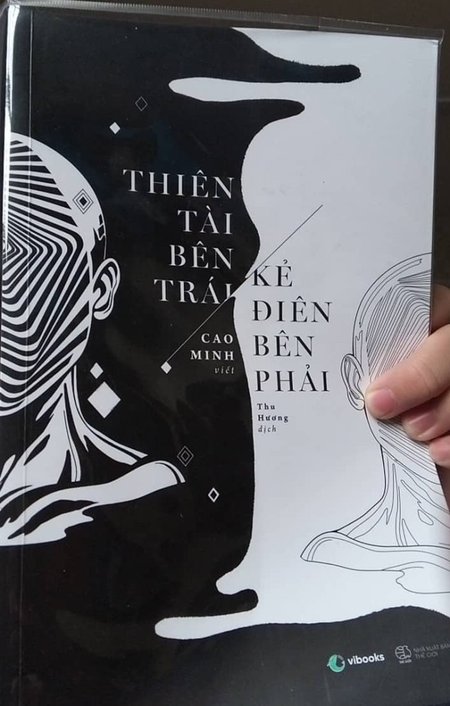

<!-- Imported from WordPress: https://thanhtung0209.home.blog/2023/01/09/mau-sac-hom-nay-cua-ban-la-gi/ -->

Ảnh đầu blog là một trang trong quyển sách "Thiên tài bên trái, kẻ điên bên phải". Quyển sách hồi hè có đọc tầm chục trang, sau đó vào năm học thì mình ngưng. Mấy hôm nay nghỉ ngơi mới tìm đọc trở lại. **_Blog này của mình không phải quảng cáo cho cuốn sách này và cũng không có ý lôi kéo bạn tìm đọc, mình chỉ muốn nêu ra cảm nhận sau khi đọc một mẫu chuyện trong cuốn sách này mà thôi._**

Sách nói về những cuộc đối thoại giữa nhân vật "Tôi", cũng chính là tác giả của sách - Cao Minh với những người bị xem là có vấn đề về thần kinh🙂. Những bệnh nhân tâm thần được cho là những kẻ mang trong mình góc nhìn quái dị, ý tưởng lạ lùng, tư duy khác biệt và những hành động bị xem là “chả ra làm sao, chả hợp thời”. Và sự khác nhau giữa người bình thường và người bệnh tâm thần ở chỗ, một bên chứng minh được thế giới quan của họ, bên còn lại thì chưa. Bằng cách đặt những câu hỏi hết sức khéo léo và thông minh, tác giả cố gắng thâm nhập vào thế giới của những bệnh nhân tâm thần, qua đó xem xét, chiêm nghiệm thế giới quan của họ.

Do đó nếu xét về mặt kiến thức thì giá trị mà nó mạng lại rất ít (chính xác là hầu như không có). Nếu xét tới mặt giải trí, xem như lại cung cấp một khía cạnh được khai thác từ một đề tài còn lạ với nhiều người: bệnh nhân tâm thần hoặc là những người mà chúng ta cho như là vậy.

Câu chuyện mình muốn đề cập đến trong sách tên là "Mưa rơi lặng thầm", mình đã đọc nó từ hè rồi nhưng gần đây nhớ lại nên muốn viết blog nói về cảm nhận của mình. Tóm tắt, nói về một cô gái tự cho rằng bản thân có khả năng nhìn thấy cái gọi là màu sắc của mỗi ngày. Màu sắc ở đây không phải là thời tiết mà là những màu đen, vàng, xanh lá, xanh biển... khi cô gái nhìn ra ngoài vào buổi sáng, nó tràn ngập và như tấm màn mỏng phủ lên toàn bộ tầm nhìn. Mỗi màu sẽ có ý nghĩa riêng, cho biết tình hình của ngày hôm đó... Và như một tương lai được định trước, dù bạn có làm gì cũng không thay đổi được sự kiện sắp xảy đến, đúng như màu sắc sáng hôm đó đã chỉ ra.

Mặc dù chỉ là một câu chuyện của một người được cho là tâm thần. Nhưng sẽ như thế nào nếu chúng ta thực sự có khả năng như vậy. Nó sẽ cho chúng ta biết trước một điềm báo, dẫn đến một sự chuẩn bị về mặt tâm lý cho những chuyện sẽ xảy ra trong ngày hôm đó. Với mình trong khoảng thời gian gần đây, nó sẽ là màu hồng hạnh phúc khi mình biết tin đậu thực tập 4 tháng, màu tím đậm vào ngày mình biết bản thân bị thủy đậu, màu xanh của sự hy vọng vào ngày mình nộp CV vị trí chính thức, màu vàng nhạt của sự mệt mỏi vào khoảng thời gian ôn thi, màu đỏ vào ngày bà nội mất... (còn nữa nhưng lười liệt kê🤣)

Khả năng đó nghe cũng có vẻ hay hay đấy chứ nhưng nó sẽ giảm đi tính bất ngờ, thú vị của cuộc sống phải không. Nên nếu được chọn thì mình vẫn muốn là người bình thường, để mỗi ngày thức dậy đều với một tâm thế hào hứng, sẵn sáng đón chờ những điều sẽ xảy đến.

Blog hôm nay giống review sách trá hình quá🤣. Cảm ơn bạn đã đọc nha❤.
