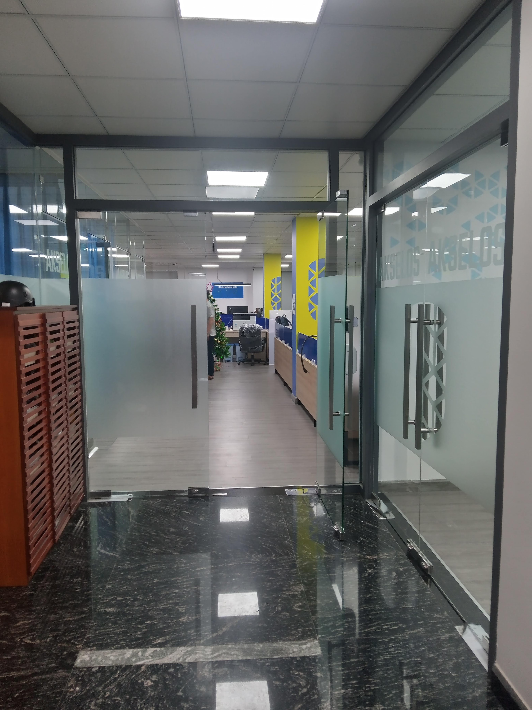

<!-- Imported from WordPress: https://thanhtung0209.home.blog/2023/01/16/ngay-thu-2-nhung-khong-phai-di-lam-nhi/ -->

Ngày thứ 2 nhưng không phải đi làm nhỉ. Dù vậy nhưng hôm nay ở nhà mình vẫn "chạy" như thường🤣.

Ngày cuối đi làm, sáng vẫn đi làm giờ như bình thường, vẫn ngồi vào bàn và làm việc như ngày bình thường, cố gắng hoàn thành thật tốt nhiệm vụ được giao, tới cuối buổi mình bàn giao máy lại cho mấy anh. Mình tới chỗ anh Minh, hỏi anh một điều mình đã thắc mắc từ hồi nhận được tin đậu thực tập tới giờ. Mình thắc mắc tại sao trong số rất nhiều người apply vào và công ty chỉ tuyển 4 người, tại sao anh lại chọn sv năm 3 còn kẹt lịch học như mình, trong khi có rất nhiều anh đã ra trường có thể làm cả tuần mà không nghỉ ngày nào. Anh Minh đã trả lời, đúng là mình còn kẹt lịch học, chưa làm xong đồ án luận văn gì cả, nhưng vẫn chọn mình vì anh nói mình đã cho mấy anh thấy một thái độ tốt, một tinh thần ham muốn học hỏi và cầu tiến và khả năng phản xạ, xử lý vấn đề nhanh. Mình cũng xin feedback của anh về mình trong khoảng thời gian qua, anh nói mình cần phải trao đổi với mọi người nhiều hơn (vì làm việc nhóm nên mình có trao đổi á nhưng vậy là chưa đủ nhiều), cần cải thiện khả năng diễn đạt để người khác hiểu mình đang nói gì (một phần do mình còn nói nói chuyện bằng giọng Quảng Trị á🤣), mình sẽ ghi nhớ và cố gắng cải thiện hơn nữa💪. Là người chủ động xin feedback, mình muốn hiểu thêm về bản thân, điều gì đã khiến mình được chọn cho vị trí này và nhận ra những điều cần cải thiện hơn nữa. Cảm ơn mấy anh rất nhiều❤.

Sau đó mình đi vòng quanh chào mấy anh một lượt, ra tới cửa tháo dép mang giày, trong lòng có cảm giác gì đó luyến tiếc, ngoảnh lại lấy điện thoại chụp lại 1 tấm, cũng chẳng biết để làm gì nữa, chắc là chụp lại khoảnh khắc tạm biệt, mong đây không phải là hình ảnh cuối cùng về nơi mình từng thực tập. Hẹn gặp lại một ngày không xa Akselos❤!
