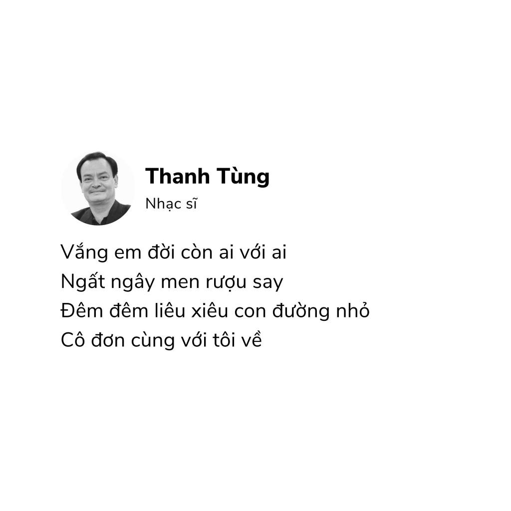

<!-- Imported from WordPress: https://thanhtung0209.home.blog/2023/06/27/nguon-goc-cai-ten-cua-minh/ -->

Nguyễn Thanh Tùng.

Hồi tiểu học, mình luôn thấy có chút gì đó tự hào về cái tên mà ba đã đặt cho mình. Với một suy nghĩ hết sức trẻ con rằng tên mình có 3 chữ, không dài nên khi viết ra trên giấy sẽ không lo bị hết chỗ, bắt đầu bằng chữ T nên kiểm tra bài hay có việc gì cũng ít lo bị gọi đầu tiên (thường giáo viên sẽ gọi người đầu sổ😆) và lúc đó cả khối (hình như là cả trường lận🙂) có mỗi mình tên là Tùng. Khi mình hỏi ba thì ba nói đặt tên theo tên của nhạc sĩ (không phải nhạc sĩ Sơn Tùng M gì gì đó đâu nha🤣), nghe xong mình cũng chỉ nhớ có vậy, còn quá nhỏ để tìm hiểu thêm.

Sau đó một thời gian, mình tình cờ lướt thấy thông tin về nhạc sĩ Nguyễn Thanh Tùng... Mình đã nghe một lượt danh sách bài hát của ông và mình đã nhận ra vài bài trong số đó mà ba mình có hát. Bài hát "Một mình" của ông rất hay và buồn nữa...

Năm 1990, vợ nhạc sĩ Thanh Tùng mắc trọng bệnh rồi ra đi khi mới ngoài 40 tuổi. Lúc lâm chung, bà có hỏi chồng rằng, nếu em chết, anh có lấy vợ mới và bỏ các con không? Nhạc sĩ Thanh Tùng trả lời: “Không!”. Và, trong suốt cuộc đời, Thanh Tùng đã giữ trọn lời hứa với vợ, ở vậy một mình nuôi 3 con khôn lớn, trưởng thành. Ca khúc là lời tâm sự của người chồng nguyện chung tình với người vợ đã khuất...(Theo báo Hà Nội Mới).

Blog nay ngắn gọn vậy thôi🤣
