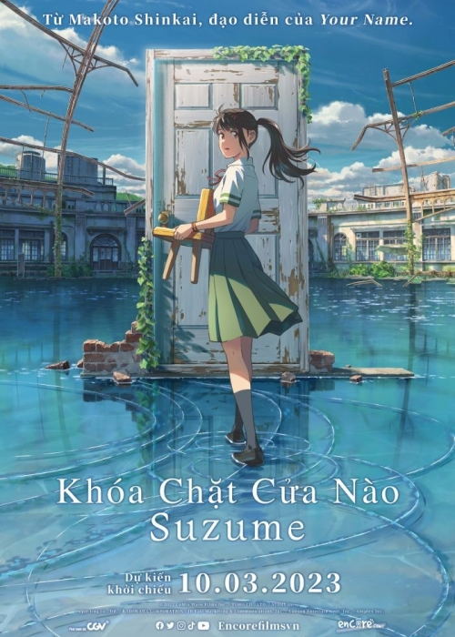
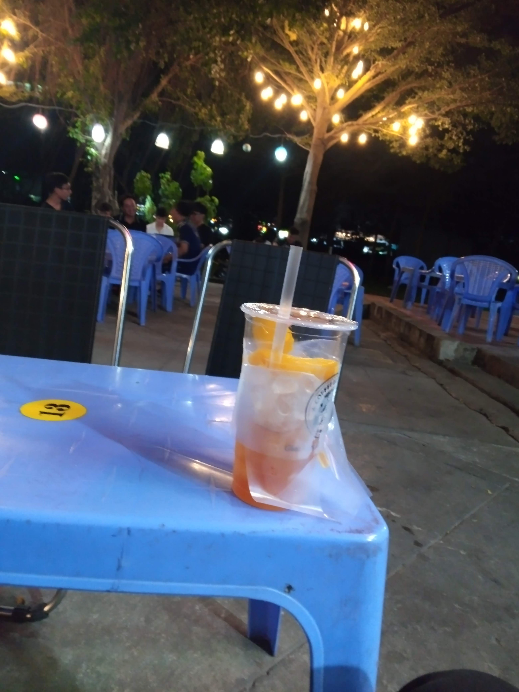

<!-- Imported from WordPress: https://thanhtung0209.home.blog/2023/03/12/%e3%81%99%e3%81%9a%e3%82%81%e3%81%ae%e6%88%b8%e7%b7%a0%e3%81%be%e3%82%8a/ -->

Tiêu đề là tên tiếng Nhật của phim (mình làm màu xíu thoi🤣). Thứ 7 tuần này mình mới đi xem. Dưới đây có một số tình tiết spoil ạ🙂.

Hình ảnh trong phim đẹp là điều chắc chắn rồi và nó gần như trở thành điều bình thường khi xem phim của Makoto, ánh sáng, đồ ăn, khung cảnh sông núi,... Ấn tượng lớn nhất của mình về anime lần này chắc là sự giúp đỡ, tương trợ lẫn nhau của các nhân vật trong phim, mỗi nhân vật đều đảm nhận một vai trò, nhiệm vụ trong phim nhưng tất cả đều có hành động giúp đỡ theo cách của mình, ngay cả là một con mèo. Chắc vì mình cũng thích giúp đỡ người khác nên ấn tượng nhiều ở điều đó🤣.

"Khi lớn lên, bạn sẽ phát hiện mình có hai bàn tay. Một bàn tay để giúp đỡ bản thân mình. Bàn tay còn lại để giúp đỡ những người xung quanh." -Audrey Hepburn-

Ngoài ra, thông điệp sự mạnh mẽ của bản thân cũng làm mình nghĩ đến. Với việc mất đi người thân từ nhỏ, nữ nhân vật chính chắc hẳn đã rất mạnh mẽ để vượt qua điều đó.

Xem xong thì mình có ghé qua một quán bên Khu B (nghĩ lại thấy mình rảnh rỗi sinh nông nổi quá🙂). Quán nước view khá đẹp và mát, ngồi uống trà đào chill chill.

Chủ nhật hôm nay, mình dành cả sáng đi mò đường🤣. Mà trước tiên phải đi bơm bánh xe đã, lốp xe mình phát hiện bị nứt mấy hôm trước, đi cũng không êm nên đoán chắc do bánh xe non hơi, ra bơm xong đi thấy khác hẳn, êm hơn rất nhiều😗. Sau đó đi tìm đường khác tới xưởng, tìm xong chạy ngược từ Biên Hòa vào quận Tân Bình, mục đích là tìm đường để tuần sau đi xem concert á🙂. Tìm xong thì qua quận 10 để đưa đồ cho chị kia, rồi về lại ký túc xá và hết buổi sáng. Đôi khi thấy mình rảnh phết haha, nhưng mà cảm giác làm xong kế hoạch mình note từ tuần trước thì thấy nhẹ nhõm hẳn. Tuần sau lại có việc cần làm tiếp...

Cố lên Tùng ơi!zozo.
