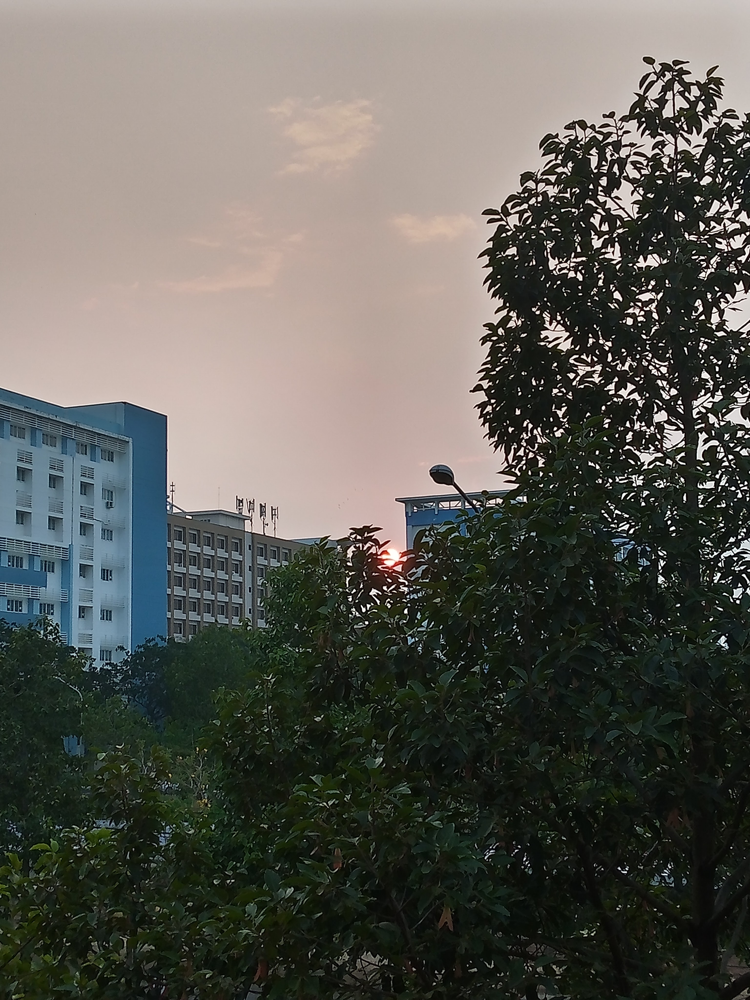

<!-- Imported from WordPress: https://thanhtung0209.home.blog/2023/04/27/tam-biet-205-a14/ -->

Vậy là cuối tuần trước là ngày mình phải dọn ra khỏi ký túc xá rồi. Những ngày cuối mình cũng vội vã dọn dẹp đồ nên cũng không có nhiều tâm trạng để lưu luyến. Đầu blog là bức ảnh chụp hoàng hôn cuối cùng ở ban công phòng 205. Đêm đến thì chắc hẳn ai cũng biết mình sắp chuyển đi rồi. Mình đến bàn Vũ đang ngồi, cuối cùng cũng thấy Vũ chơi game khác ngoài Genshin Impact rồi🤣. Vũ là người ít nói nhất và khó gần nhất trong phòng, tính mình thì trung hòa nên ai trong phòng mình cũng nói chuyện được🤣, cả 2 ngồi nói chuyện với nhau một lúc. Tiếp theo là Việt, người duy nhất chủ động phu mình bưng đồ và chất đồ lên xe, cũng là người mình nói chuyện hợp nhất trong phòng, tui đi rồi nhưng khi nào cần hỏi về Vẽ Kỹ thuật thì cứ hỏi online cũng được nhé, chúc ông qua môn để không bị rớt lần 2🤣.

Mình còn nhớ, mình là người đầu tiên đặt chân vào căn phòng 205. Ấn tượng đầu tiên là một căn phòng cũ kĩ và bụi bặm, cũng đúng thôi vì lúc đó mình là một đứa lần đầu phải sống ở một nơi xa nhà đến vậy. Giây phút bước vào căn phòng ấy, trong lòng mình tự nhủ khoảng thời gian sắp tới sẽ khó khăn vì phải tự lập một mình. Ấy vậy mà mình đã ở căn phòng 205 đó 4 năm rồi (thật ra là chưa tới tại còn nghỉ hè với dịch nên không ở ký túc xá, này là mình nói phóng đại vậy thôi🤣).

Tạm biệt ban công view hoàng hôn đẹp, tạm biệt mấy cô ở căn tin A8, tạm biệt cô chú tạp hóa A4... Tạm biệt Vũ, Việt, Thông. Sau này có "Duyên" nhất định sẽ gặp lại nhưng chắc chắn sẽ không phải là ở phòng 205-A14 nữa rồi...
