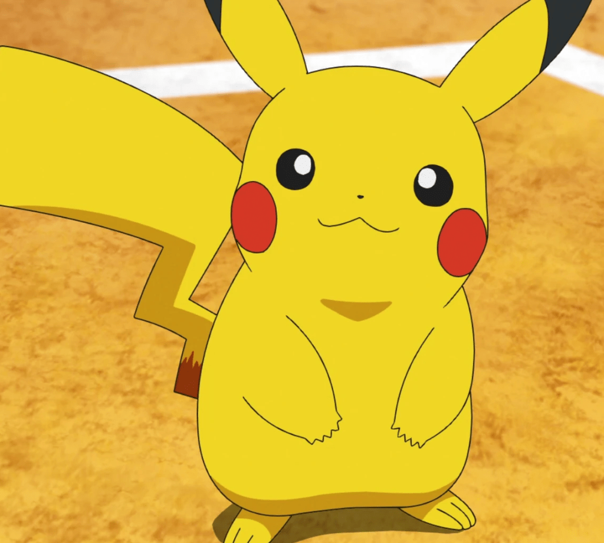

<!-- Imported from WordPress: https://thanhtung0209.home.blog/2022/12/21/the-distant-blue-sky/ -->

_Hình ảnh là poster cho tập phim đặc biệt có tên The Distant Blue Sky_ _để_ _kỷ niệm 25 năm cuộc hành trình của Satoshi và cũng là món quà chia tay của tác giả để chuẩn bị cho phần mới với những nhân vật mới_😢.

Có thể bạn chưa từng xem qua [Pokémon](https://vi.wikipedia.org/wiki/Pok%C3%A9mon) nhưng chắc hẳn cũng đã một lần nghe qua cái tên Pikachu rồi đúng không. Nhìn ảnh bên dưới xem có nhớ ra gì không nha😗.

Vào tháng 4-1997, Satoshi và Pikachu đã rời khỏi thị trấn Masara để bắt đầu chuyến hành trình và gặp nhiều Pokémon, nhiều người bạn và phiêu lưu qua nhiều địa điểm, vùng đất khác nhau. Mục tiêu của cậu, được miêu tả ở tập đầu tiên, là trở thành Bậc Thầy Pokemon (Pokemon Master) vĩ đại nhất. Trong suốt cuộc hành trình với mục tiêu lớn lao đó, cậu đã trải qua rất nhiều khó khăn, thất bại. Và sau 25 năm, tập phim tháng 11-2022, cậu đã có được chức vô địch thế giới đầu tiên, tiến xa hơn trên con đường trở thành Pokemon Master (anime chiếu 25 năm nhưng trong phim thì cậu chỉ mới mười mấy tuổi thôi🙂). Mặc dù là người đã một thời gian dài không theo dõi Pokemon nhưng khi đọc được tin trên mình cũng thấy có gì đó hạnh phúc lây🤣.

Nhớ hồi nhỏ đợi mẹ đi chợ về mua đĩa Pokemon để xem, xem một mạch đến khi hết đĩa thì thôi và xem đi xem lại tới khi nào mẹ mua tiếp đĩa mới mới thôi🙂. Sau này lớn hơn chút thì trên tivi có chiếu vào buổi chiều tối (kênh nào quên mất tiêu) thì mình cũng có xem luôn (hồi nhỏ nghiền lắm🙂). Hồi nhỏ xem mình cũng rất thích tính cách của Satoshi. Đến giờ khi nhớ lại, những tính cách đó thật sự là thứ mình luôn muốn bản thân hướng tới. Đó là luôn cố gắng và sẵn sàng để giúp đỡ người khác trong khả năng, mặc kệ người quen hay lạ. Luôn tò mò điều mới, tích cực học hỏi và rèn luyện không ngừng. Tính cách đặc trưng nữa của Satoshi là “Không bao giờ bỏ cuộc”, trong những trận đấu tưởng chừng sẽ nhận lấy thất bại, cậu luôn chiến đấu đến cùng cùng với Pokemon của mình (đây là tính cách mình thích nhất ở Satoshi).

Sau đây là cảm nhận của mình khi nhìn ảnh poster _The Distant Blue Sky_. Bầu trời xanh mang lại cảm giác bình yên và thanh thản, mỗi người biết đến cuộc hành trình của Satoshi và Pikachu đến giây phút thấy họ vô địch thế giới đều cảm thấy trong lòng có gì đó mãn nguyện, nhất là khi đây là phần cuối nói về Satoshi. Bầu trời cao rộng, xanh thẳm tạo cảm giác bản thân nhỏ bé trước thiên nhiên và thế giới rộng lớn mang nghĩa cuộc phiêu lưu của họ vẫn còn, phía trước còn nhiều điều khám phá, nhiều thử thách cần chinh phục. Satoshi và Pikachu ngắm nhìn bầu trời với sự yên bình trong tâm hồn khi đã vượt qua một chặng đường dài, sự hài lòng khi đạt được kết quả tốt chứng minh khả năng, nỗ lực của họ và là sự sẵn sàng đón nhận những điều mới mẻ phía trước. Bầu trời xanh, không mưa cho thấy một tín hiệu tốt...

Cuộc hành trình của Satoshi vẫn còn rất dài và cả tụi mình nữa... Hy vọng blog này sẽ khích lệ một phần nào đó tinh thần của bạn, không ngừng nỗ lực cố gắng. Không chắc sẽ đạt được kết quả cuối cùng như bản thân mong đợi ban đầu nhưng trên hành trình đó mình sẽ đạt được những kết quả tốt đẹp khác, mà chính những kết quả này lại minh chứng cho nỗ lực của bản thân và tiếp thêm động lực để mình tiếp tục đi tiếp. Như cách Satoshi chứng minh bản thân đã trưởng thành hơn như thế nào trong cuộc hành trình của mình...

Cảm ơn các bạn đã đọc❤❤❤.
