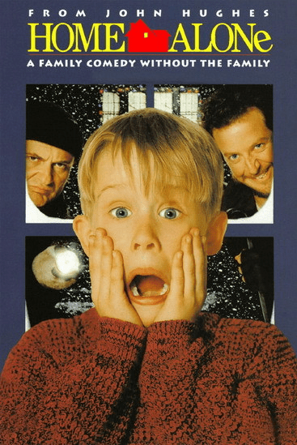
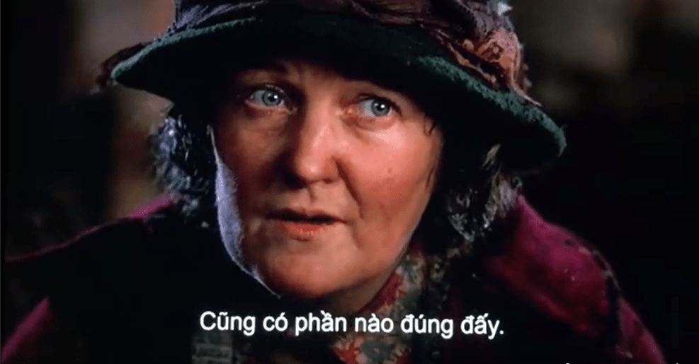

<!-- Imported from WordPress: https://thanhtung0209.home.blog/2022/12/25/thong-diep-tu-mot-bo-phim-cu/ -->

Bộ phim mình muốn đề cập đến có tên là _Home Alone 2_: _Lost in New York_. Một bộ phim lấy khoảng thời gian Giáng sinh làm cột mốc sự kiện. Phần đầu có tên _Home Alone_. Cả 2 phần mình đều đã xem qua lúc còn nhỏ với cái tivi Sony đời cũ, phim hay lắm có gì bạn rảnh xem thử, đang mùa Giáng sinh luôn nè😆.

Một trích đoạn trong Home Alone 2 mà bản thân mình khi còn nhỏ đã từng xem qua nhưng với những suy nghĩ còn ngây ngô của một đứa trẻ, mình chưa hiểu hết được ý nghĩa thực sự của những lời thoại trong phim (thậm chí không có ấn tượng gì về lời thoại, nhưng hình ảnh bà lão với đàn bồ câu đặc biệt đó thì có😆). Để rồi gần đây lướt FB tình cờ xem lại, chợt nhận ra bộ phim tuổi thơ đã mang đến một thông điệp nghĩa hơn thế, chứ không dừng lại ở một bộ phim giải trí đơn thuần.

Sau những sự đau đớn, tuyệt vọng của một mối quan hệ đổ vỡ, chúng ta tự thu mình về một góc, khoá trái con tim lại. Chúng ta nghĩ rằng trái tim không còn biết yêu nữa, sau họ chẳng còn ai phù hợp và cả cuộc đời sẽ chẳng một ai thay thế được họ nữa. Nhưng mình tin chẳng ai sinh ra là dành cho ai bao giờ, phải chăng là do chính ta tự đóng lòng mình, từ chối yêu thương vì nỗi sợ tổn thương ở thời điểm hiện tại mà đánh đồng luôn cả quãng thời gian sau này.

Mong cho những người mang trong mình trái tim bị tổn thương sẽ mở rộng trái tim bản thân mình ra. Vì cuộc đời muôn màu muôn vẻ, đừng vì chuyện buồn hôm qua mà bỏ lỡ cả ngày tươi đẹp hôm nay...

Đường link dẫn tới đoạn lời thoại trong phim: (_thực sự rất mong bạn đọc blog này có thể truy cập vào để xem vì nó thực sự hay_🙂) [https://www.facebook.com/watch/?v=517637088641227](https://www.facebook.com/watch/?v=517637088641227)

_If you aren't going_ to _use your heart_, _then_ what's the _difference if_ it _gets broken_?

Cảm ơn bạn đã đọc và chúc bạn có những ngày cuối năm ấm áp, hạnh phúc nha❤❤❤.
