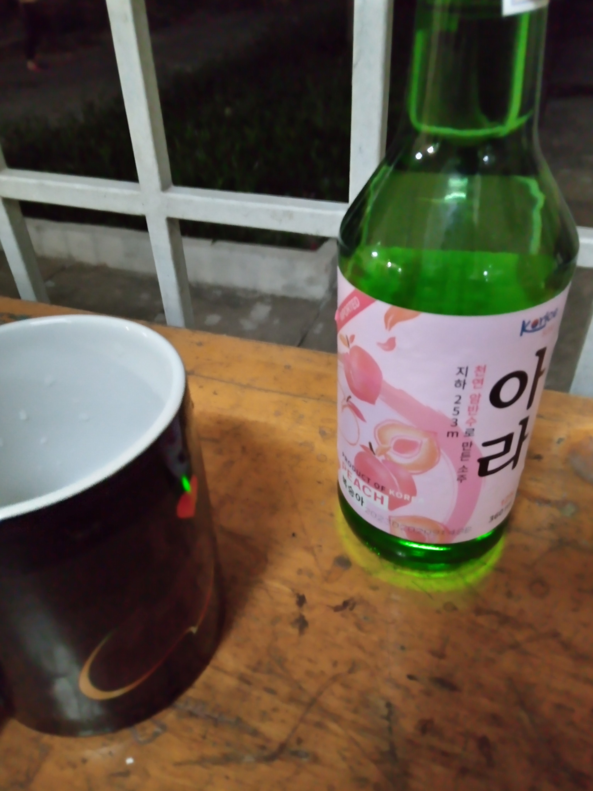

<!-- Imported from WordPress: https://thanhtung0209.home.blog/2023/04/09/tong-hop-dau-thang-4/ -->

Phần 1 - 02/04/2023:

Như thông lệ, cứ đến tháng 4 là cộng đồng anime lại cùng nhau nhắc đến bộ anime tuy đã ra từ 2014 nhưng những cảm xúc mang lại vẫn còn để lại dư âm đến hiện tại - đó chính là bộ Shigatsu wa Kimi no Uso (Your Lie In April). Và Kirameki - ending theme 1 của bộ này là những lời yêu ngọt ngào của chàng trai gửi đến người con gái mình yêu thương và qua đó truyền tải thông điệp "dù người bạn yêu thương có như thế nào thì họ vẫn luôn đẹp trong mắt bạn". Ngoài bài này mình muốn chia sẻ ra thì anime này còn nhiều bài theme hay khác, bạn có thể tìm hiểu thêm trên Youtube nha.

Bài hát "Tháng tư là lời nói dối của em", theo lời của Hà Anh Tuấn cũng được lấy cảm từ bộ anime này.

Nói thật là mình chưa xem bộ này vì nghe nó buồn lắm nên lười xem🤣.

https://www.youtube.com/watch?v=LDDAwKs6YBw&ab\_channel=JustMe

Phần 2 - 08/04/2023:

Nổi hứng thèm uống Soju nên quyết định vác xe đi mua 2 chai về tự uống một mình🤣. Trong blog trước đây của mình, tên là , mình có đề cập đến việc uống thử Soju lần đầu tiên khi đi chơi Vũng Tàu cùng cty thực tập cũ. Lúc đó thấy khó nó khó uống nên uống ít lắm, bỗng nhiên mấy tháng sau cảm thấy thèm uống lại, chẳng hiểu vì sao nữa🙂. Trong phòng thấy bí bách, xuống trệt của tòa gió mát ơi là mát😂. Vừa uống vừa xem Youtube chill chill.

Phần 3:

Việc thực tập ở xưởng thuận lợi hơn mình nghĩ. Nếu cứ tiếp tục như vậy thì có thể tháng sau mình sẽ thử xin vào xưởng của thầy làm luôn. Cố lên Tùng ơi! Chaizoooo!
