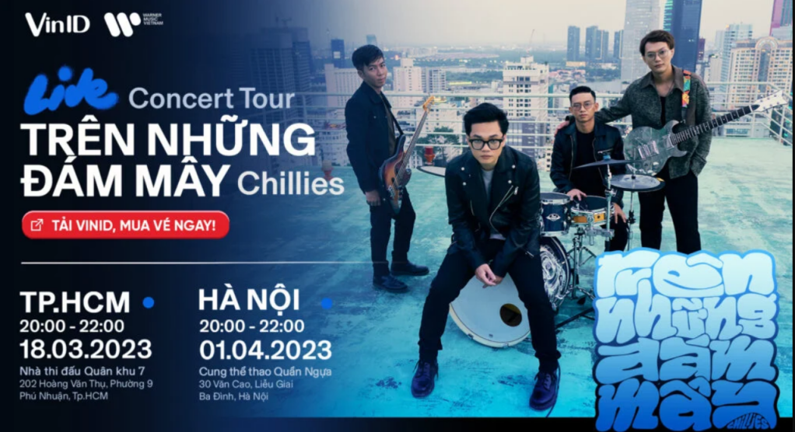

<!-- Imported from WordPress: https://thanhtung0209.home.blog/2023/03/25/tren-nhung-dam-may/ -->

Người Mỹ khi muốn mô tả niềm sung sướng hạnh phúc của họ, người ta hay nói: I’m on cloud nine và người Anh có thể nói: I’m over the moon – tôi hạnh phúc sung sướng quá (tiếng Việt có thể hiểu là “bay lên 9 tầng mây” hoặc “bay lên cung trăng” vì vui sướng). Và cũng xuất phát từ đó "Trên những đám mây" đã trở thành tên concert của nhóm Chillies mà mình đã đi xem hôm 18/3 vừa qua. Theo lời anh Khang, hạnh phúc như bay lên 9 tầng mây là cảm xúc của anh khi cuối cùng concert đầu tiên của nhóm cũng được tổ chức, anh còn gọi ngày hôm nay là cuối cùng cũng "trả nợ" cho các fan thành công🤣. Đây là concert đầu tiên của nhóm trong 5 năm hoạt động vừa qua và cũng là lần đi xem concert đầu tiên của mình.

Lúc nghe tin có concert thì cũng phân vân dữ lắm vì lúc mới thấy giá vé thì thấy nó cao hơn mình tưởng tượng ban đầu, sau khi bình tĩnh lại và tìm hiểu thì mới biết giá vé cho concert như vậy là mức trung bình thấp🙂. Mình mua vé hạng F (vé có giá thấp nhất) và cũng chuẩn bị tâm lý ngồi xa không thấy được gì🤣. Tới lúc vào ngồi thì rất bất ngờ là gần hơn mình nghĩ rất nhiều😗, do nhà thi đấu nó không rộng như sân vận động (mình nhầm là sân vận động, đến ngày diễn ra concert mới nhận ra và phải tìm lại đường mới😆). Lần đầu đi nên mình đi rất sớm, ai ngờ sớm quá lên ngồi bơ vơ một mình đợi suốt gần 5 tiếng đồng hồ mới được nghe mấy anh hát🙂. Tới đoạn này mình xin phép được thú tội vì đã thoáng chốc nghĩ mấy xấu cho mấy anh, tại vì mới anh Khang cất giọng lên hay nghe quá giống như nuốt đĩa vậy nên mình tưởng anh hát nhép🤣, phải một lúc sau mới chắc chắn một điều là anh Khanh hát live đỉnh quá. Không biết dùng từ gì miêu tả nữa (dở ngữ văn quá nó vậy á🙂), mọi thứ đều tuyệt vời, không hề hối hận vì đã mua vé đi xem. Âm thanh, hiệu ứng hình ảnh, sân khấu, mọi thứ đều làm mình rất thỏa mãn. Cách sắp xếp trình tự bài hát biểu diễn cũng rất hay, càng về cuối càng thấy mấy anh sung sức hơn, cháy hơn❤. Không chỉ mình mà rất nhiều người trong nhà thi đấu đã thực sự bay lên 9 tầng mây rồi...

Thật sự là một kỷ niệm đáng nhớ. Hứa 5 năm nữa có concert của nhóm mình sẽ đi xem tiếp (mà mong tới lúc đó có người đi cùng chứ đi một mình cũng hơi buồn bạn🤣).
