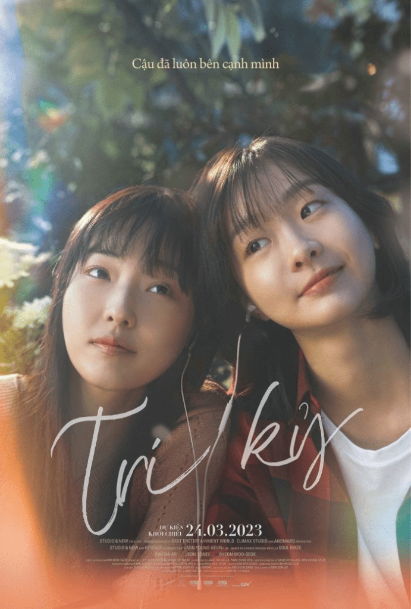

<!-- Imported from WordPress: https://thanhtung0209.home.blog/2023/04/09/tri-ky/ -->

Vừa rồi mình có đi xem phim Tri kỷ. Mình cũng tranh thủ cơ hội này để thử một phong cách mới với 1 cái áo khoác mới, 1 cái áo thun mới và 1 đôi giày mới (ăn mặc đẹp vậy rồi đi một mình🤣). Kịch bản của "Soulmate" được chuyển thể từ tác phẩm nổi tiếng "Thất Nguyệt và An Sinh". Nội dung phim mình sẽ không đề cập đến trong blog này vì làm vậy nghe giống như đang review vậy🙂, mà chỉ nêu lên cảm nhận của bản thân về bộ phim. Mình thấy phim hay và ý nghĩa bộ phim muốn truyền tải cũng ý nghĩa nữa.

"Tri kỷ là người hiểu được mình. Trên cuộc đời này mà tìm được một người có thể hiểu được mình thì mình là người có hạnh phúc. Món quà quý nhất mà người kia có thể tặng cho mình là khả năng hiểu được mình. Có những người sống trong cuộc đời này mà chưa bao giờ tìm được một người có thể gọi là hiểu mình cả. Dù là con trai hay con gái, trong cuộc sống này nếu mình có thể tìm được một người có khả năng lắng nghe mình, có thể hiểu được những khó khăn, những khổ đau, những ước vọng của mình thì tức là mình tìm thấy nơi người đó một tâm hồn tri kỷ. Tri kỷ là biết nhau, là hiểu nhau." --Thích Nhất Hạnh--.

Một người tri kỷ còn là người cảm nhận được bạn mà không cần bạn nói một lời. Tri kỷ là người khiến bạn cười trong khi bạn cảm thấy đau khổ và buồn bã. Là người đọc được suy nghĩ của bạn ngay cả khi bạn không biết điều gì đang xảy ra bên trong...

Có một đoạn trong phim. Khi Ha Eun (Jeon So Nee thủ vai) nhìn Mi So (Kim Da Mi thủ vai) từ phía sau và Ha Eun đã nói rằng quen nhau lâu như vậy rồi nhưng đây là lần đầu được nhìn rõ bóng lưng của Mi So như vậy. Không phải vì thiếu sự quan tâm mà là do họ luôn đi bên cạnh nhau, không ai bị để mặc hoặc bị bỏ rơi một mình. Đoạn phim này làm mình rất ấn tượng.

Có người nói rằng: Một ngày nào đó trên thế giới rộng lớn này chúng ta sẽ gặp được một người thuộc về riêng mình, một người bạn, một nửa tâm hồn, người mà chúng ta có thể kể cho họ nghe về những giấc mơ của mình. Người ấy sẽ là người nhìn vào mắt bạn và nói rằng bạn là người tuyệt vời nhất mà họ từng gặp.

Nhưng mình tự hỏi liệu bản thân phải mất bao lâu và phải may mắn đến mức nào để tìm được một người tri kỷ thật sự giữa Sài Gòn bộn bề đông đúc - nơi mà mọi người sống chồng lên nhau này nhỉ...
