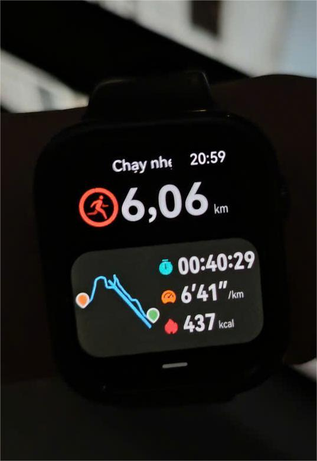
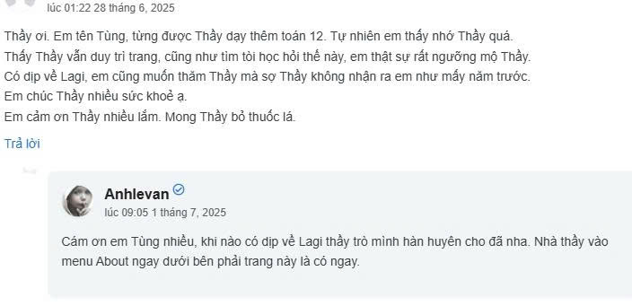

<!-- Imported from WordPress: https://thanhtung0209.home.blog/2025/07/27/updating/ -->

2 ảnh đầu là mình tự setup góc chụp, chế độ hẹn giờ đếm ngược 10 giây. Nhìn cũng oke đấy hehe. Máy ảnh cùi nên ảnh còn sạn chưa được nét lắm. Mình cũng cập nhật phần thẻ "Hình ảnh", nếu bấm vào hãy đợi một chút để ảnh load hết nhé.

Chà, cũng một thời gian rồi mình mới vào lại đây. Cuộc sống hiện tại của mình đã đi vào quỹ đạo ổn định, timeline khá dày đặc, ít thời gian trống, cũng chưa thật sự có điều gì quá nổi trội. Nếu viết những blog ngắn với những câu chuyện bình thường, liệu có ổn không? Hmmm...

Tận dụng điều kiện ổn định hiện tại để tiếp tục "build up" từng ngày. Dù chưa có kết quả gì nổi bật, nhưng mình hiểu rằng bản thân đang trong giai đoạn phát triển về lượng. Trong Triết học, khi phát triển đủ về lượng thì sẽ đạt sự thay đổi về chất. Mình tin rằng bản thân đang xây dựng một nền móng tốt, để phục vụ cho việc xậy lên những kiến trúc khác bên trên nó.

Ngoài những thói quen trong timeline như đã kể trước đây thì mình cũng chú ý vấn đề sức khỏe hơn. Bắt đầu thêm thói quen chạy bộ từ cuối tháng 5 và đã duy trì đến hôm nay. Mỗi tuần 3-4 buổi, mỗi buổi tuần 5km. Ngoài chạy bộ ra thì việc tận dụng thời gian trống sau khi nấu ăn tối để tập tạ, tập bụng, hít xà, cũng giúp mình cải thiện thể trạng hơn trước. Vì nấu ăn tối gần như là hằng ngày nên việc tập cũng đều đặn theo.

Mình vẫn hay nhớ về những kỷ niệm cũ, rồi nhớ những người gắn liền với kỷ niệm đó. Đó là Thầy dạy toán có tâm, người anh lớn tuổi hơn quen ở chỗ trọ cũ với mindset tốt, những người bạn cùng phòng ktx cũ,. Mình tìm thử thông tin họ từ mạng để xem thử liệu họ hiện đang như thế nào. Thầy Ánh vẫn cập nhật trang blog của Thầy với những bài hát, thông tin kiến thức hay. Bạn cùng phòng ktx cũ tập gym, có ny và học thạc sĩ xong, đàn em nhỏ tuổi nhất phòng thì đã ra trường với bằng Xuất sắc và tìm được việc ở một công ty tốt. Anh ở cùng khu trọ cũ thì đã có bằng thạc sĩ và tìm được việc đúng ngành mà anh muốn, sau khoảng thời gian bỏ công việc ngân hàng để học Data analyst. Chà, ai cũng đang cố gắng để trở nên tốt hơn theo cách riêng của họ. Mình cũng cảm thấy vui khi thấy những kết quả đó, vì mình hiểu để có được những điều đó là không hề dễ tí nào, nhìn mà thấy tự hào lây hehe. Ngoài ra còn nhiều chuyện mình nhớ lại nữa, kể ra dài lắm nên thôi. Mà có khi nào bản thân thuộc kiểu người "Nostalgia"🤣 không ta. Đùa thôi, nói vậy thì hơi quá.

Thời gian qua có vài bộ phim mình đã xem và thấy khá hay, ý nghĩa. Bạn đang đọc blog này nếu có hứng cũng có thể tìm và xem thử. "_The Pursuit of Happyness_" (Mưu cầu hạnh phúc), một bộ phim giúp thêm động lực để cố gắng, tìm ý nghĩa cho cuộc sống, chưa bao giờ là quá trễ để bắt đầu lại, do Will Smith (có phim _Men in Black_ hồi nhỏ xem cũng rất hay) và con trai (đóng phim _Karate Kid_ 2010) đóng. Tiếp theo là "_Monster_" của đạo diễn Hirokazu Koreeda, bộ phim cho thấy cái chúng ta thấy đôi khi không phải là sự thật, mỗi người đôi khi chứa đựng những câu chuyện riêng, đều có thể là một Monster trong câu chuyện của người khác. Ngoài ra, mình cũng gợi ý những bộ phim khác của vị đạo diễn được xem là bảo vật của điện ảnh Nhật Bản, "_Shoplifters_", "_Like Father, Like Son_", "_Broker_" (có Song Kang-ho đóng), "_The Third Murder_", "_Nobody Know_". Ban đầu khi xem "_Monster_", mình không biết đang xem phim của vị đạo diễn trên mà chỉ biết phim đạt giải thưởng cao. Khi xem một lúc mới thấy phong cách làm phim này rất quen, sau đó lên tra mình mới biết🙃, một phong cách trần trụi, xoáy sâu vào tâm lý nhân vật, từ từ đào sâu, tìm đến sự gai góc của số phận con người ẩn khuất trong những câu chuyện cá biệt. Tiếp theo là 2 bộ phim của diễn viên nổi tiếng Leonardo DiCaprio, là "_The Revenant_" và "_Shutter Island_", 2 bộ phim hấp dẫn, kịch tính. "_A Brighter Summer Day_", một trong những tác phẩm điện ảnh Hoa ngữ hay nhất mọi thời đại, bộ phim kể về vụ án thiếu niên giết người đầu tiên xảy ra tại Đài Loan, cũng là phim đầu tiên của Trương Chấn, tạo tiền đề cho sự nghiệp nổi tiếng sau này của nam tài tử. "Schindler's List", "The Pianist", cũng là 2 bộ phim đề tài lịch sử thế chiến 2 rất hay, nếu biết chút về kiến thức lịch sử xem càng hay🤣. _"The Devil Wears Prada_", một bộ phim rất hay đạt nhiều giải thưởng, liên quan đến thời trang, có Anne Hathaway đóng, nghe nói sắp tới có phần 2 sau gần 20 năm🙃. Và "_All About Lily Chou-Chou_", một bộ phim lấy bối cảnh thập niên 90 hay còn gọi là thập niên mất mát của Nhật, vỡ bong bóng kinh tế ảnh hưởng đến nhiều khía cạnh khác nhau bao trùm lên xã hội. Không khí ảm đạm bủa vây những đứa trẻ cấp 2-lứa tuổi mà tâm lý có những biến đổi quan trọng và cũng dễ bị tổn thương nhất, tụi nhỏ đều cảm nhận sự ngột ngạt, bí bách, mờ mịt nhưng mỗi cá nhân lại có hành động khác nhau để đối mặt với nghịch cảnh. Là buông xuôi, hay bị cuốn sâu vào không lối thoát, hay vượt lên nghịch cảnh với nội tâm mạnh mẽ... Cũng còn vài bộ phim nữa, nhưng mình chỉ nêu những bộ phim hay, mình đánh giá cao và ý nghĩa thôi.

À tí quên, thời gian qua mình cũng có tạo một playlist những bài hát mà mình thích trên Spotify, cũng đang thêm vào dần dần nên cũng chưa nhiều lắm. Share cho mọi người rảnh ghé vào nghe thử luôn nhe. Mục Public Playlists nhé.

[https://open.spotify.com/user/31cdjduepkktvezzjb5yn7m7hhwa?si=517b14cd783c4d81](https://open.spotify.com/user/31cdjduepkktvezzjb5yn7m7hhwa?si=517b14cd783c4d81)

Nhắc đến âm nhạc. Hồi trước khi thấy ba mẹ mình dưỡng già và rảnh rỗi, mình có khuyên ba mẹ nên mua sách để giữ đầu óc minh mẫn. Hiện tại, ngoài tập thể dục, âm nhạc là thứ ba mẹ mình dành thời gian vào. Ba cầm guitar, mẹ thì hát, ghi chép lời bài hát để học. Cũng hay có bạn chỗ khác tìm đến chơi, đàn hát để không gian nhà cửa thêm vui vẻ, tươi tắn hơn. Mỗi tuần ba mẹ đều thay phiên vào Sài Gòn thăm cháu. Lại nhắc tới cháu, sắp phải mua quà tặng cháu òi, mừng tròn 1 tuổi.

Gần đây, mình cũng tìm hiểu kiến thức về kinh tế-tài chính. Ngoài gửi tiết kiệm tích lũy ngân hàng ra thì chứng chỉ quỹ mở (mình đang tìm hiểu chứng chỉ quỹ của TCBS) hay cổ phiếu (rủi ro cao) với tăng trưởng dài hạn mình cũng đang khá quan tâm. Việc đa dạng danh mục đầu tư cũng giúp hạn chế rủi ro hơn. Hiện tại còn trẻ, có nhiều thời gian để học hỏi, làm quen với thị trường để lấy kinh nghiệm đầu tư về sau và số vốn bỏ ra chưa nhiều (nếu có rủi ro thì cũng thiệt hại không nhiều) thì mình nghĩ việc tìm hiểu của mình là không thừa. Quỹ mở thì an toàn về dài hạn, dù có biến động thì mình vẫn có thể bán bất cứ lúc nào vào thời điểm phù hợp. Cổ phiếu thì rủi ro cao nên mình chưa ưu tiên nhưng vẫn tìm hiểu và theo dõi thị trường.

Tới đây thì blog cũng dài quá rồi. Muốn gõ thêm gì đó mà chắc sẽ ở những blog sau. Thật sự chưa bao giờ cảm thấy hài lòng về bản thân như thời điểm hiện tại, cả thể chất lẫn tinh thần. Dẫu biết rằng bản thân còn nhiều thiếu sót, khuyết điểm nhưng mình tin với những việc mình đang làm hiện tại, mình sẽ trở thành phiên bản tốt nhất có thể của bản thân trong tương lai.

**_Updating..._**
